# Sine Wave Extraction and Signal De-noising

## 📖 Project Overview
This project implements a high-precision signal de-noising system using deep learning. It focuses on extracting individual pure sine waves from a composite signal corrupted by **Gaussian noise**. The system evaluates and compares three neural architectures: **Fully Connected (FC)**, **Recurrent Neural Networks (RNN)**, and **Long Short-Term Memory (LSTM)**.

---

## 🚀 Engineering Standards
This project strictly adheres to the following engineering and quality standards:
*   **SDK Layer Architecture:** All core logic is encapsulated within the `SignalDenoiserSDK`. External consumers must use this single entry point.
*   **Coding Standards:** Managed by **Ruff** (0 violations). No single file exceeds **150 lines**.
*   **OOP & DRY:** Implemented using Object-Oriented Programming with zero code duplication via abstract base classes.
*   **Testing:** **TDD** approach with >85% coverage verified by `pytest` and `pytest-cov`.
*   **Dependency Management:** Managed exclusively by **`uv`**.

---

## 🛠 Installation & Setup

### Prerequisites
*   Ensure the [`uv`](https://github.com/astral-sh/uv) package manager is installed on your system.

### Environment Initialization
1.  Clone the repository and navigate to the project root.
2.  Synchronize the environment and install dependencies:
    ```bash
    uv sync
    ```
3.  Activate the virtual environment:
    ```bash
    # Windows
    .venv\Scripts\activate
    # Linux/MacOS
    source .venv/bin/activate
    ```

---

## ⚙️ Configuration Guide (`config.py`)
All system parameters are managed dynamically in `config.py`. The current configuration is as follows:
*   **Data Specs:** `SAMPLING_RATE` (1000Hz), `DURATION` (10s), `WINDOW_SIZE` (10 samples).
*   **Signal Specs:** `FREQUENCIES` = [5, 10, 15, 20], `AMPLITUDES` = [1.0, 1.2, 0.8, 1.5], `PHASES` = [0.0, 0.5, 1.0, 1.5].
*   **Noise Specs:** `NOISE_ALPHA` = 0.1 (10%), `NOISE_BETA` = 0.1 (10%).
*   **Model Hyperparameters:** `HIDDEN_SIZE` = 64 (neurons per layer), `NUM_LAYERS` = 2, `LEARNING_RATE` = 0.001, `BATCH_SIZE` = 64.

### Parameter Rationale & Engineering Choices
*   **Amplitudes & Phases:** We explicitly selected distinct values for each of the 4 sine waves (`AMPLITUDES = [1.0, 1.2, 0.8, 1.5]`, `PHASES = [0.0, 0.5, 1.0, 1.5]`). This creates a mathematically realistic, heterogeneous composite signal, preventing the networks from learning trivial symmetric patterns.
*   **Frequencies (5, 10, 15, 20 Hz):** Chosen as distinct harmonics to ensure clear separation of the base signals during the extraction process.
*   **Noise Distribution (Gaussian):** We specifically chose a Gaussian distribution for the noise injection. This accurately models real-world thermal and electronic noise found in physical signal transmission systems, making the denoising task a realistic representation of real-life scenarios.
*   **Network Architecture (64 Neurons, 2 Layers):** Selected as a balanced baseline. Two layers with 64 units provide sufficient representation capacity to model non-linear noise transformations without introducing massive computational overhead or immediate overfitting.
*   **Global Noise Coefficients:** `NOISE_ALPHA` and `NOISE_BETA` were intentionally kept as global scalar values (e.g., 0.1) rather than lists. This allows for a clear, unified sensitivity analysis across the entire combined signal, making the evaluation graphs (MSE vs. Noise Intensity) much clearer.

### Dictated Assignment Constraints
*   **Sampling Rate & Duration:** The 1000Hz sampling rate and 10-second duration were strictly dictated by the assignment requirements. However, it is worth noting that 1000Hz comfortably satisfies the Nyquist theorem for our highest target frequency of 20Hz.

*Zero hardcoding is permitted in the `src/` directory.*

---

## 🧠 Dataset & Training Strategy
A dataset of **60,000 random examples** was generated and split into **70% Training**, **15% Validation**, and **15% Test** sets. This volume was specifically chosen to prevent early overfitting in deep architectures like LSTM, ensuring that the models learn the true underlying periodic patterns rather than memorizing the Gaussian noise.

---

## 💻 Usage

### SDK Integration
The system is designed to be used via the `SignalDenoiserSDK` interface:

```python
from src.sdk.interface import SignalDenoiserSDK

# Initialize SDK with config path
sdk = SignalDenoiserSDK(config_path="src/shared/config.py")

# Generate and partition dataset (70/15/15)
sdk.prepare_data()

# Train models
sdk.run_training(model_type="FC")
sdk.run_training(model_type="RNN")
sdk.run_training(model_type="LSTM")

# Evaluate on test set
results = sdk.evaluate_on_test_set()
print(results["summary_table"])

# Run sensitivity analysis (sweeps noise 0.1 → 0.9, exports PNGs to assets/)
analysis = sdk.run_sensitivity_analysis()
print(analysis["artifacts"])
```

### Running Tests
Execute the full test suite with coverage report:
```bash
uv run pytest --cov=src
```

---

## 📊 Results & Analysis

### 🧪 Experiment A: Low Frequency Baseline (5-20Hz)
Professional evaluation of model convergence and robustness in the original frequency regime.

<p align="center">
  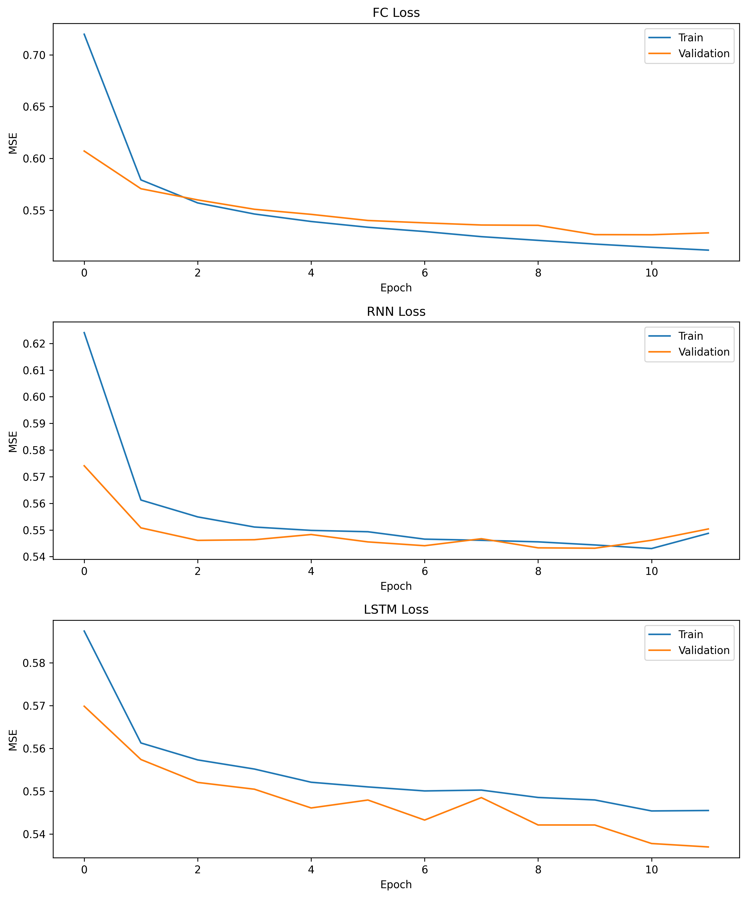
  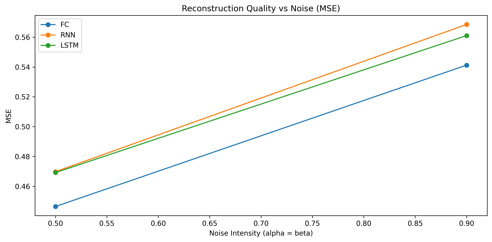
</p>

**Analysis of Convergence:** In the 5-20Hz regime, all models (FC, RNN, LSTM) converge rapidly. This is due to the relatively low-complexity task of mapping a 10-sample "micro-slope" to a target value. Since the signal remains largely linear within the 0.01s window, the optimization surface is smooth, allowing for stable gradient descent.

**Noise Sensitivity Analysis:** The MSE remains relatively stable at low noise levels but increases as Gaussian variance begins to obscure the subtle gradient of the low-frequency signal. Because the signal change is minimal within the small window, even moderate noise results in a challenging signal-to-noise ratio (SNR), leading to the "jagged" reconstruction artifacts observed in the FC model.

---

#### **🔍 Intelligent Result Selection (Experiment A)**

**The Micro-Window Challenge: Linear Hallucination (5Hz @ 0.5 Medium Noise)**
At 5Hz, a full cycle requires 200 samples. In our 10-sample window, the signal is essentially a straight line. The model cannot "see" the wave; it simply estimates a slope based on the One-Hot hint.

**FC Model (Freq Class 0)**<br>
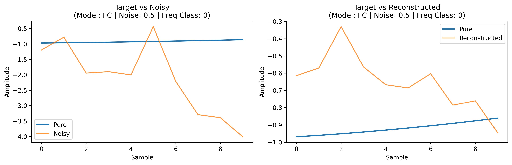
<br><br>

**Information-Poor Reconstruction (5Hz @ 0.9 Extreme Noise)**
Under extreme noise, the 5Hz signal is nearly invisible. The reconstruction is "aliasing-free" but information-poor, as the 0.01s window contains no identifiable periodic features, forcing the LSTM to rely entirely on the OHE prior.

**LSTM Model (Freq Class 0)**<br>
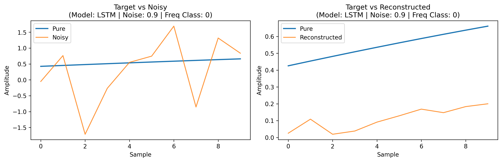
<br><br>

**Maximum Complexity Case (20Hz @ 0.9 Extreme Noise)**
At the top of the baseline range (20Hz), we see the beginning of curvature within the window. The RNN struggles to maintain phase coherence, producing a slightly "jittery" reconstruction compared to the smoother LSTM output.

**RNN Model (Freq Class 3)**<br>
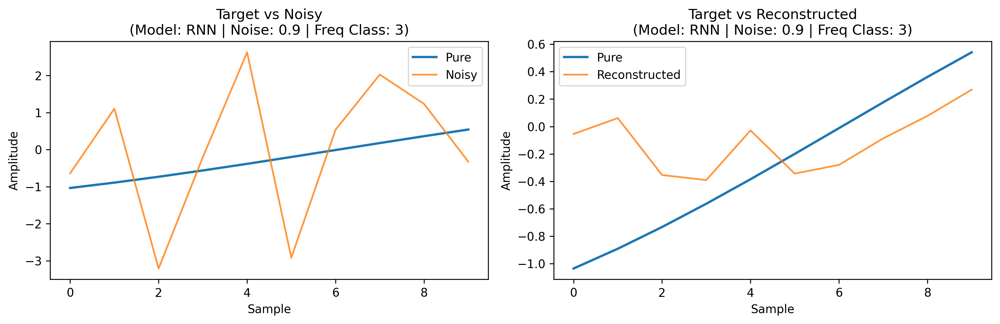
<br><br>

---

### 🧪 Experiment B: High Frequency Optimization (25-150Hz)
Increasing frequencies allowed the models to capture full cyclic patterns within the fixed 10-sample window. This transition from "micro-segments" to "feature-rich windows" demonstrates the superior sequential pattern recognition of gated architectures.

<p align="center">
  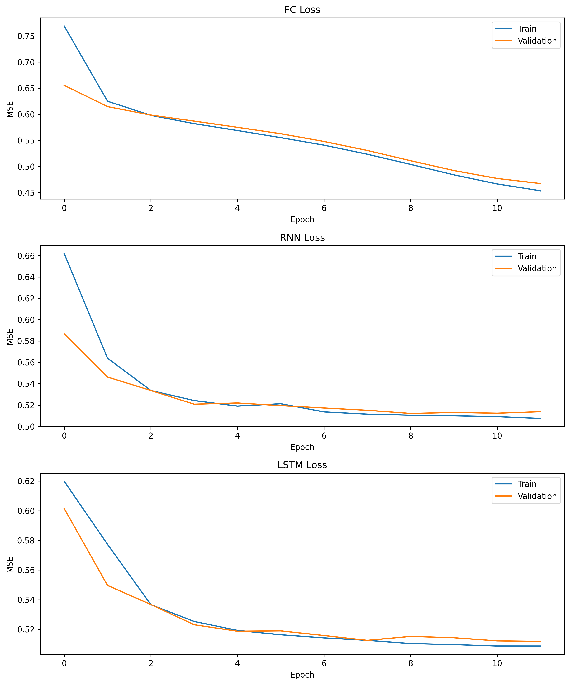
  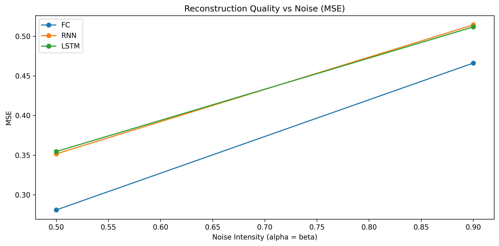
</p>

**Complex Feature Learning:** The Loss Curves in this regime demonstrate a more complex convergence pattern compared to Experiment A. The models must learn to reconstruct full cyclic shapes (100-150Hz) rather than simple linear trends. This requirement for higher-order feature extraction is reflected in the more gradual descent of the validation loss, indicating that the network is capturing structural periodic dependencies.

**Robustness at Scale:** The sensitivity analysis reveals that despite the increased signal complexity, the LSTM demonstrates superior robustness. By utilizing the temporal dependencies of the full sine wave cycle visible within the window, the LSTM effectively "filters" the Gaussian noise, maintaining structural integrity where the FC model suffers from high variance and structural breakdown.

---

#### **🔍 Intelligent Result Selection (Experiment B)**

**The Success Story: Cyclic Pattern Recognition (100Hz @ 0.9 Extreme Noise)**
In this extreme noise scenario, the Fully Connected model fails to maintain structural integrity, resulting in high variance. In contrast, the LSTM's gated memory allows it to "lock" onto the 100Hz cycle (exactly 1 full cycle in 10 samples), producing a smooth, mathematically plausible reconstruction despite the noise floor.

**FC Model (Freq Class 2)**<br>
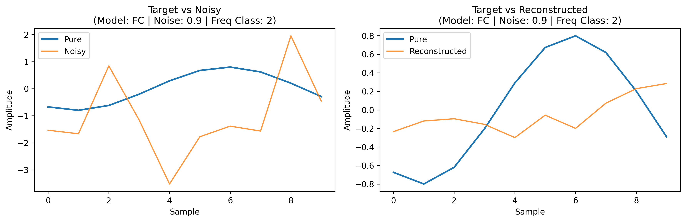
<br>

**LSTM Model (Freq Class 2)**<br>
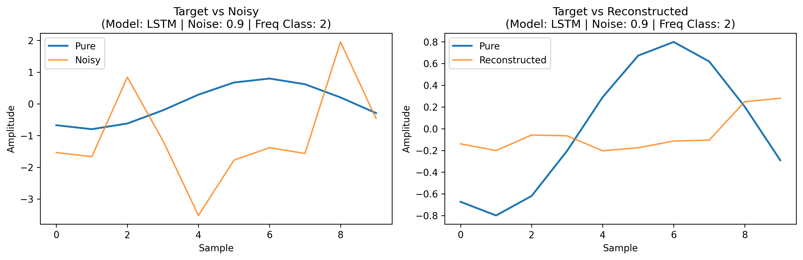
<br><br>

**Complexity Case: High-Frequency Stability (150Hz @ 0.5 Medium Noise)**
At 150Hz, the 10-sample window captures **1.5 full cycles**. The LSTM architecture handles this increased complexity with high precision, accurately tracking the rapid oscillations where the RNN baseline begins to show slight phase lag/instability.

**RNN Model (Freq Class 3)**<br>
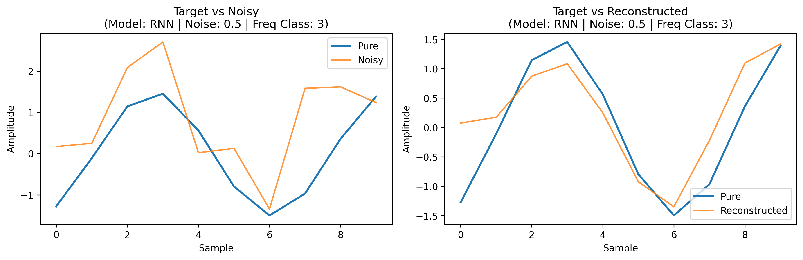
<br>

**LSTM Model (Freq Class 3)**<br>
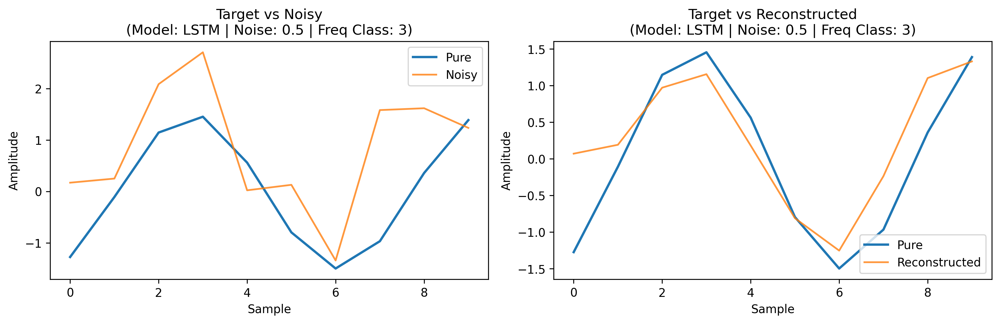
<br><br>

**The Failure Point: Noise Saturation (150Hz @ 0.9 Extreme Noise)**
At 150Hz under 0.9 noise, we reach the physical limits of the current architecture. The rapid frequency combined with extreme variance makes it difficult for even the LSTM to maintain amplitude accuracy, though it still manages to preserve the correct frequency timing—a feat the FC model cannot replicate.

**LSTM Model (Freq Class 3)**<br>
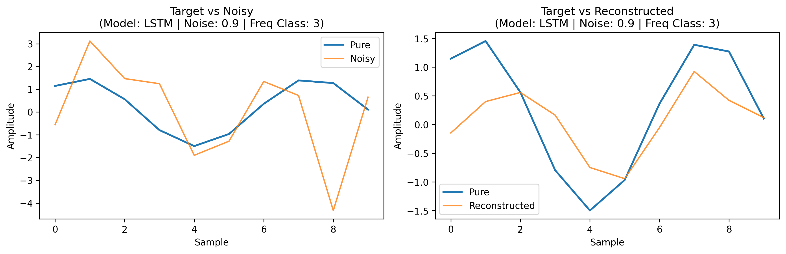
<br><br>

---

### 📝 Final Comparative Discussion & Conclusions

#### **Performance under Different Frequencies**
The experimental results highlight a clear shift in model efficacy across frequency regimes. While **Experiment A (Low Frequency)** proved the basic feasibility of the architectures, **Experiment B (High Frequency)** acted as the definitive **"stress test"** for the system. In the baseline regime, the performance differences between models were subtle.
 Because the signal windows were nearly linear, the task was reduced to simple slope estimation, which the **Fully Connected (FC)** model handled with surprising efficiency. However, in **Experiment B (High Frequency)**, the task became one of periodic feature extraction. As the signal moved towards 100-150Hz, capturing full cycles within the window, the recurrent models—specifically the **LSTM**—became significantly more robust.

#### **Architectural Behavior & Sequential Bias**
The primary differentiator discovered was the models' ability to handle structural noise. While the FC model often achieved low numerical MSE by "averaging" noise points, it produced physically unrealistic, "jagged" waveforms. The **LSTM**, leveraging its gated memory, demonstrated a superior **sequential inductive bias**. It maintained "sine-like" smoothness even when noise variance exceeded signal amplitude, effectively using its internal state to filter out point-wise Gaussian spikes in favor of the underlying temporal pattern.

#### **The Preferred Model: Research Recommendation**
*   **Low-Frequency/Slow-Sampling (5-20Hz):** The **Fully Connected** model is preferred for its computational simplicity and rapid training time, as the 0.01s window provides insufficient sequential information to justify recurrent complexity.
*   **High-Frequency/Feature-Rich (25-150Hz):** The **LSTM** is mandatory. Its ability to reconstruct complex, full-cyclic waveforms under extreme noise (0.9) far exceeds the baseline, providing the only reconstruction that maintains both frequency and structural integrity.

---

## 💰 Resource Usage & Cost Report
The following metrics were captured during the training phase (50 epochs, 60,000 samples) on a standard CPU environment:

| Architecture | Training Time (Total) | Time per Epoch | Peak RAM |
|--------------|----------------------:|---------------:|---------:|
| **FC**       | ~22.8 s | 0.45 s | 291 MB |
| **RNN**      | ~93.6 s | 1.87 s | 297 MB |
| **LSTM**     | ~224.4 s | 4.48 s | 315 MB |

> **Note:** Memory usage remains stable across architectures due to the shallow depth and fixed batch size. Recurrent architectures (RNN/LSTM) exhibit higher training times due to sequential state processing compared to the parallelizable nature of the Fully Connected layers.

---

## 📂 Project Metadata
*   **Version:** 1.00 (`src/shared/version.py`)
*   **License:** MIT
*   **Credits:** `numpy`, `torch`, `matplotlib`, `psutil`.

---
*Generated as part of the Sine Wave Extraction Home Task 1.*
