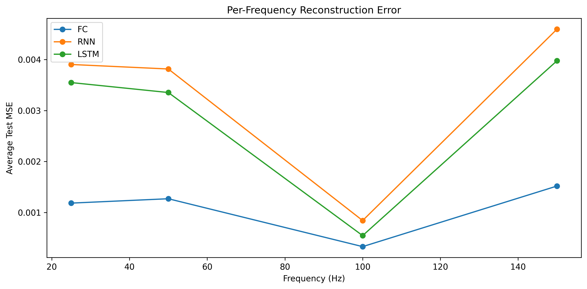

# Sine Wave Extraction and Signal De-noising

## 📖 Project Overview
This project implements a homework-aligned signal de-noising system using deep learning. Each dataset entry follows the contract `[C, sigma, noisy_window] -> clean_window`, where `C` is a 4-class one-hot vector for the selected frequency, `sigma` is the noise percentage, `noisy_window` is a 10-sample noisy segment of the selected sine wave, and `clean_window` is the matching 10-sample pure target. The system evaluates and compares three neural architectures: **Fully Connected (FC)**, **Recurrent Neural Networks (RNN)**, and **Long Short-Term Memory (LSTM)**.

---

## 🚀 Engineering Standards
This project strictly adheres to the following engineering and quality standards:
*   **SDK Layer Architecture:** All core logic is encapsulated within the `SignalDenoiserSDK`. External consumers must use this single entry point.
*   **Coding Standards:** Managed by **Ruff** (0 violations). Authored code and test modules stay within the file-length cap.
*   **OOP & DRY:** Implemented using Object-Oriented Programming with zero code duplication via abstract base classes.
*   **Testing:** **TDD** approach with >85% coverage verified by `pytest` and `pytest-cov`.
*   **Dependency Management:** Managed exclusively by **`uv`**.

---

## 🛠 Installation & Setup

### Prerequisites
*   Ensure the [`uv`](https://github.com/astral-sh/uv) package manager is installed on your system.

### Environment Initialization
1.  Clone the repository and navigate to the project root.
2.  Synchronize the environment and install dependencies:
    ```bash
    uv sync
    ```
3.  Activate the virtual environment:
    ```bash
    # Windows
    .venv\Scripts\activate
    # Linux/MacOS
    source .venv/bin/activate
    ```

---

## ⚙️ Configuration Guide (`config.py`)
All system parameters are managed dynamically in `config.py`. The current configuration is as follows:
*   **Data Specs:** `SAMPLING_RATE` (1000Hz), `DURATION` (10s), `WINDOW_SIZE` (10 samples).
*   **Signal Specs:** `FREQUENCIES` = [25, 50, 100, 150], `AMPLITUDES` = [1.0, 1.2, 0.8, 1.5], `PHASES` = [0.0, 0.5, 1.0, 1.5].
*   **Noise Specs:** `NOISE_ALPHA` = 0.1 (10%), `NOISE_BETA` = 0.1 (10%), with `sigma` passed explicitly as an input feature.
*   **Model Hyperparameters:** `HIDDEN_SIZE` = 64 (neurons per layer), `NUM_LAYERS` = 2, `LEARNING_RATE` = 0.001, `BATCH_SIZE` = 64.

### Parameter Rationale & Engineering Choices
*   **Amplitudes & Phases:** We explicitly selected distinct values for each of the 4 sine waves (`AMPLITUDES = [1.0, 1.2, 0.8, 1.5]`, `PHASES = [0.0, 0.5, 1.0, 1.5]`). This creates a mathematically realistic, heterogeneous composite signal, preventing the networks from learning trivial symmetric patterns.
*   **Frequencies (25, 50, 100, 150 Hz):** Chosen to span a range from partial-cycle windows to feature-rich windows while remaining comfortably below the Nyquist limit at 1000Hz sampling.
*   **Noise Distribution (Gaussian):** We specifically chose a Gaussian distribution for the noise injection. This accurately models real-world thermal and electronic noise found in physical signal transmission systems, making the denoising task a realistic representation of real-life scenarios.
*   **Homework Contract:** The model input mirrors the assignment text directly: 4 one-hot frequency bits, 1 scalar sigma value, and a 10-sample noisy window. The target is the matching 10-sample pure window.
*   **Network Architecture (64 Neurons, 2 Layers):** Selected as a balanced baseline. Two layers with 64 units provide sufficient representation capacity to model non-linear noise transformations without introducing massive computational overhead or immediate overfitting.
*   **Global Noise Coefficients:** `NOISE_ALPHA` and `NOISE_BETA` were intentionally kept as global scalar values (e.g., 0.1) rather than lists. This allows for a clear, unified sensitivity analysis across the entire combined signal, making the evaluation graphs (MSE vs. Noise Intensity) much clearer.

### Dictated Assignment Constraints
*   **Sampling Rate & Duration:** The 1000Hz sampling rate and 10-second duration were strictly dictated by the assignment requirements. The current 150Hz maximum target frequency remains safely below the 500Hz Nyquist limit.

*Zero hardcoding is permitted in the `src/` directory.*

---

## 🧠 Dataset & Training Strategy
A dataset of **60,000 random examples** was generated and split into **70% Training**, **15% Validation**, and **15% Test** sets. Each input vector contains **15 values**: 4 one-hot frequency bits, 1 sigma value, and 10 noisy samples from the selected wave. Each target vector contains the corresponding 10 clean samples from the same frequency class. This volume was chosen to give all three architectures enough coverage over phase, amplitude, and noise realizations without collapsing into trivial memorization.

---

## 💻 Usage

### SDK Integration
The system is designed to be used via the `SignalDenoiserSDK` interface:

```python
from src.sdk.interface import SignalDenoiserSDK

# Initialize SDK with config path
sdk = SignalDenoiserSDK(config_path="src/shared/config.py")

# Generate and partition dataset (70/15/15)
sdk.prepare_data()

# Train models
sdk.run_training(model_type="FC")
sdk.run_training(model_type="RNN")
sdk.run_training(model_type="LSTM")

# Evaluate on test set
results = sdk.evaluate_on_test_set()
print(results["summary_table"])
print(results["artifacts"]["frequency_mse_comparison"])

# Run sensitivity analysis (sweeps noise 0.1 → 0.9, exports PNGs to assets/)
analysis = sdk.run_sensitivity_analysis()
print(analysis["artifacts"])

# Generate a compact markdown lab summary
report = sdk.generate_report()
print(report)
```

### CLI Entry Point
Run the same workflow through the top-level script, which talks to the system only via the SDK:

```bash
uv run python main.py --models FC RNN LSTM
```

Use `--skip-sensitivity` or `--skip-report` when you want a faster run.

### Running Tests
Execute the full test suite with coverage report:
```bash
uv run pytest --cov=src
```

Artifact-producing tests redirect their outputs to temporary paths, so rerunning the suite does not dirty the committed figures under `assets/`.

For the current sections 2-8 compliance snapshot, see `docs/COMPLIANCE_CHECKLIST.md`.

---

## Results Snapshot
The current experiment assets are organized by regime:
- `assets/v1_low_freq/` stores the archived 5-20Hz baseline.
- `assets/v2_high_freq/` stores the active 25-150Hz experiment.

## Experiment A: Low Frequency Baseline (5-20Hz)
This regime is the archived baseline stored under `assets/v1_low_freq/`.

<p align="center">
    
    
</p>

All models converge quickly because a 10-sample window over 5-20Hz is almost linear. The task is closer to slope estimation than full waveform reconstruction, so low-noise optimization is stable and the FC baseline remains competitive.

Representative figures:
- `assets/v1_low_freq/reconstruction_fc_freq0_noise0_5.png`
- `assets/v1_low_freq/reconstruction_lstm_freq0_noise0_9.png`
- `assets/v1_low_freq/reconstruction_rnn_freq3_noise0_9.png`

## Experiment B: High Frequency Optimization (25-150Hz)
This is the active configuration and writes to `assets/v2_high_freq/`.

<p align="center">
    
    
</p>

Once the 10-sample window contains meaningful curvature or full cycles, recurrent models become more shape-aware. The FC model can still stay competitive on raw pointwise MSE, but the LSTM tends to preserve smoother waveform structure under harder noise settings.

<p align="center">
    
</p>

Representative figures:
- `assets/v2_high_freq/reconstruction_fc_freq2_noise0_9.png`
- `assets/v2_high_freq/reconstruction_lstm_freq2_noise0_9.png`
- `assets/v2_high_freq/reconstruction_rnn_freq3_noise0_5.png`
- `assets/v2_high_freq/reconstruction_lstm_freq3_noise0_5.png`
- `assets/v2_high_freq/reconstruction_lstm_freq3_noise0_9.png`

## Conclusions
- Low-frequency windows are information-poor, so the FC baseline is a pragmatic choice there.
- High-frequency windows expose the benefit of temporal inductive bias.
- The LSTM is the preferred model when waveform smoothness and timing matter more than marginal differences in scalar MSE.

## Resource Usage
The following metrics were captured during the training phase (50 epochs, 60,000 samples) on a standard CPU environment:

| Architecture | Training Time (Total) | Time per Epoch | Peak RAM |
|--------------|----------------------:|---------------:|---------:|
| **FC**       | ~22.8 s | 0.45 s | 291 MB |
| **RNN**      | ~93.6 s | 1.87 s | 297 MB |
| **LSTM**     | ~224.4 s | 4.48 s | 315 MB |

## Project Metadata
- **Version:** 1.00 (`src/shared/version.py`)
- **License:** MIT
- **Credits:** `numpy`, `torch`, `matplotlib`, `psutil`

