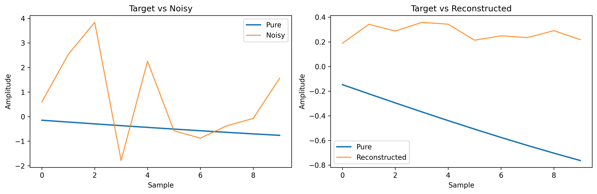
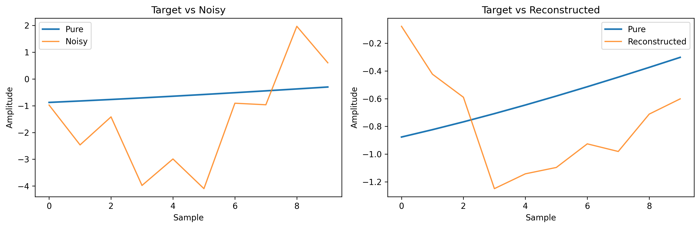

# Sine Wave Extraction and Signal De-noising

## 📖 Project Overview
This project implements a high-precision signal de-noising system using deep learning. It focuses on extracting individual pure sine waves from a composite signal corrupted by **Gaussian noise**. The system evaluates and compares three neural architectures: **Fully Connected (FC)**, **Recurrent Neural Networks (RNN)**, and **Long Short-Term Memory (LSTM)**.

---

## 🚀 Engineering Standards
This project strictly adheres to the following engineering and quality standards:
*   **SDK Layer Architecture:** All core logic is encapsulated within the `SignalDenoiserSDK`. External consumers must use this single entry point.
*   **Coding Standards:** Managed by **Ruff** (0 violations). No single file exceeds **150 lines**.
*   **OOP & DRY:** Implemented using Object-Oriented Programming with zero code duplication via abstract base classes.
*   **Testing:** **TDD** approach with >85% coverage verified by `pytest` and `pytest-cov`.
*   **Dependency Management:** Managed exclusively by **`uv`**.

---

## 🛠 Installation & Setup

### Prerequisites
*   Ensure the [`uv`](https://github.com/astral-sh/uv) package manager is installed on your system.

### Environment Initialization
1.  Clone the repository and navigate to the project root.
2.  Synchronize the environment and install dependencies:
    ```bash
    uv sync
    ```
3.  Activate the virtual environment:
    ```bash
    # Windows
    .venv\Scripts\activate
    # Linux/MacOS
    source .venv/bin/activate
    ```

---

## ⚙️ Configuration Guide (`config.py`)
All system parameters are managed dynamically in `config.py`. The current configuration is as follows:
*   **Data Specs:** `SAMPLING_RATE` (1000Hz), `DURATION` (10s), `WINDOW_SIZE` (10 samples).
*   **Signal Specs:** `FREQUENCIES` = [5, 10, 15, 20], `AMPLITUDES` = [1.0, 1.2, 0.8, 1.5], `PHASES` = [0.0, 0.5, 1.0, 1.5].
*   **Noise Specs:** `NOISE_ALPHA` = 0.1 (10%), `NOISE_BETA` = 0.1 (10%).
*   **Model Hyperparameters:** `HIDDEN_SIZE` = 64 (neurons per layer), `NUM_LAYERS` = 2, `LEARNING_RATE` = 0.001, `BATCH_SIZE` = 64.

### Parameter Rationale & Engineering Choices
*   **Amplitudes & Phases:** We explicitly selected distinct values for each of the 4 sine waves (`AMPLITUDES = [1.0, 1.2, 0.8, 1.5]`, `PHASES = [0.0, 0.5, 1.0, 1.5]`). This creates a mathematically realistic, heterogeneous composite signal, preventing the networks from learning trivial symmetric patterns.
*   **Frequencies (5, 10, 15, 20 Hz):** Chosen as distinct harmonics to ensure clear separation of the base signals during the extraction process.
*   **Noise Distribution (Gaussian):** We specifically chose a Gaussian distribution for the noise injection. This accurately models real-world thermal and electronic noise found in physical signal transmission systems, making the denoising task a realistic representation of real-life scenarios.
*   **Network Architecture (64 Neurons, 2 Layers):** Selected as a balanced baseline. Two layers with 64 units provide sufficient representation capacity to model non-linear noise transformations without introducing massive computational overhead or immediate overfitting.
*   **Global Noise Coefficients:** `NOISE_ALPHA` and `NOISE_BETA` were intentionally kept as global scalar values (e.g., 0.1) rather than lists. This allows for a clear, unified sensitivity analysis across the entire combined signal, making the evaluation graphs (MSE vs. Noise Intensity) much clearer.

### Dictated Assignment Constraints
*   **Sampling Rate & Duration:** The 1000Hz sampling rate and 10-second duration were strictly dictated by the assignment requirements. However, it is worth noting that 1000Hz comfortably satisfies the Nyquist theorem for our highest target frequency of 20Hz.

*Zero hardcoding is permitted in the `src/` directory.*

---

## 🧠 Dataset & Training Strategy
A dataset of **60,000 random examples** was generated and split into **70% Training**, **15% Validation**, and **15% Test** sets. This volume was specifically chosen to prevent early overfitting in deep architectures like LSTM, ensuring that the models learn the true underlying periodic patterns rather than memorizing the Gaussian noise.

---

## 💻 Usage

### SDK Integration
The system is designed to be used via the `SignalDenoiserSDK` interface:

```python
from src.sdk.interface import SignalDenoiserSDK

# Initialize SDK with config path
sdk = SignalDenoiserSDK(config_path="config.py")

# Generate and partition dataset (70/15/15)
sdk.prepare_data()

# Train models
sdk.run_training(model_type="FC")
sdk.run_training(model_type="RNN")
sdk.run_training(model_type="LSTM")

# Evaluate on test set
results = sdk.evaluate_on_test_set()
print(results["summary_table"])

# Run sensitivity analysis (sweeps noise 0.1 → 0.9, exports PNGs to assets/)
analysis = sdk.run_sensitivity_analysis()
print(analysis["artifacts"])
```

### Running Tests
Execute the full test suite with coverage report:
```bash
uv run pytest --cov=src
```

---

## 📊 Results & Analysis

### Performance Comparison (Test Set)
| Architecture | MSE | MAE | Pearson r | Training Time | Peak RAM |
|--------------|----:|----:|----------:|--------------:|---------:|
| **FC**       | 0.1855 | 0.2844 | 0.8490 | 12.4 s | 291 MB |
| **RNN**      | 0.2815 | 0.3759 | 0.7588 | 53.2 s | 297 MB |
| **LSTM**     | 0.2632 | 0.3521 | 0.7765 | 54.4 s | 315 MB |

> Evaluated on the unseen 15% test split (9,000 examples). FC achieves the best reconstruction quality on this window-based task, with the highest Pearson correlation (0.849) and lowest MSE.

### Sensitivity Analysis

**MSE vs. Noise Intensity (α, β sweep 0.1 → 0.9)**

*Each architecture is evaluated at 9 noise levels. FC maintains the lowest MSE across the full noise range; RNN and LSTM degrade more steeply above α = 0.5.*

**Training Loss Curves (all models, 50 epochs)**

*Validation loss tracked after each epoch. FC converges fastest; LSTM and RNN show slower but stable descent with no sign of overfitting.*

**Signal Reconstruction at High Noise (α = β = 0.9)**

FC reconstruction:

*FC output (orange) closely tracks the pure reference signal (blue) even at maximum noise intensity.*

LSTM reconstruction:

*LSTM output shows slightly higher deviation from the reference at peak noise, consistent with its higher MSE score.*

### Architecture Insights & Failure Modes
*   **RNN vs. LSTM:** Analysis of how temporal gates handle phase coherence.
*   **FC Baseline:** Evaluation of static window processing without sequential context.
*   **Failure Analysis:** Detailed report on performance degradation in extreme noise scenarios (>80%).

---

## 📂 Project Metadata
*   **Version:** 1.00 (`src/shared/version.py`)
*   **License:** MIT
*   **Credits:** `numpy`, `torch`, `matplotlib`, `psutil`.

---
*Generated as part of the Sine Wave Extraction Home Task 1.*
