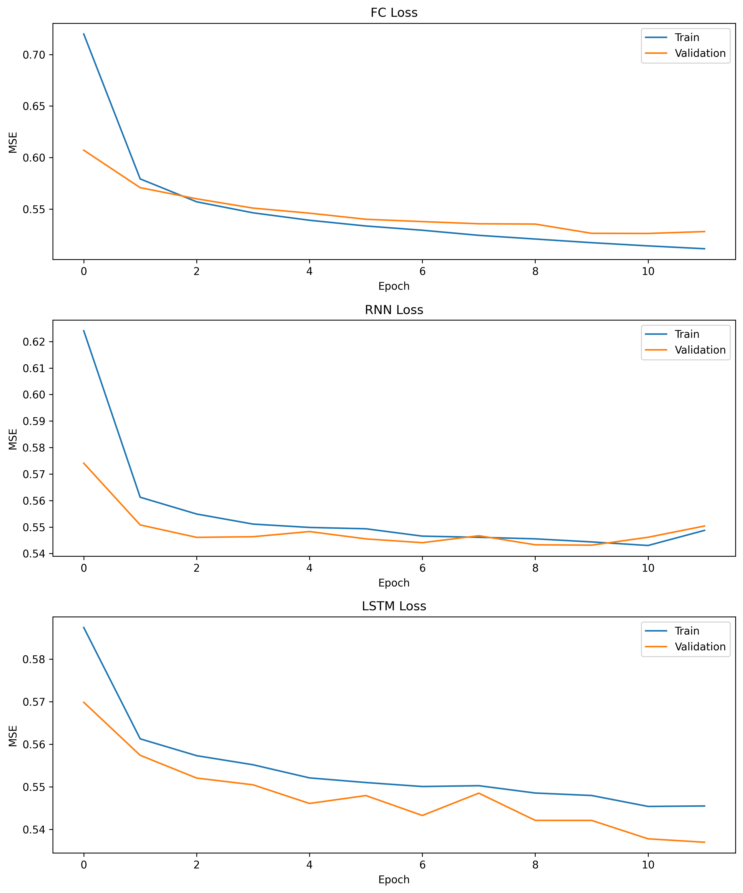
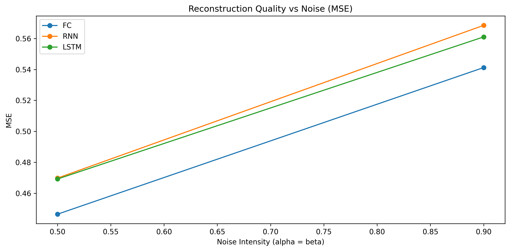
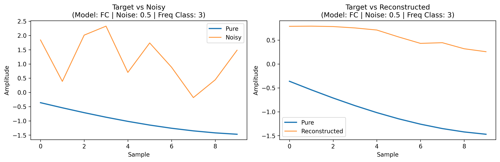
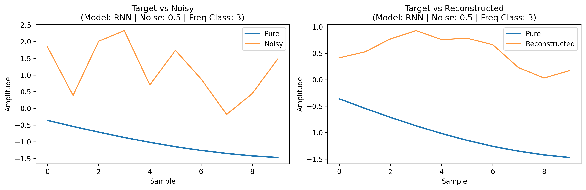
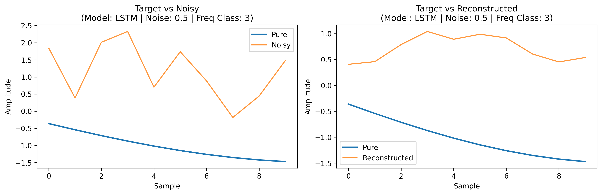
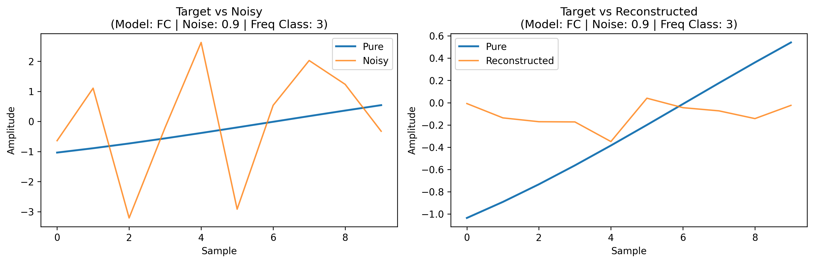
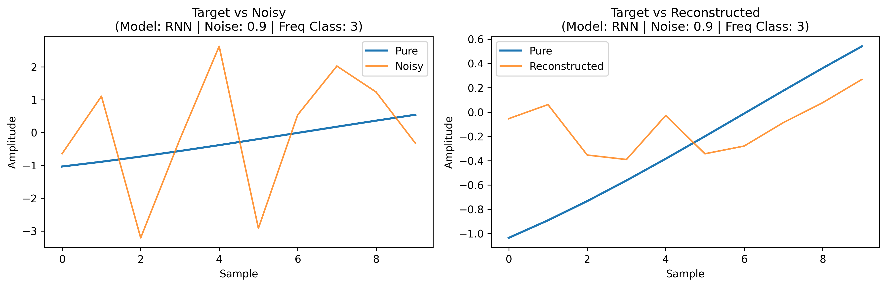
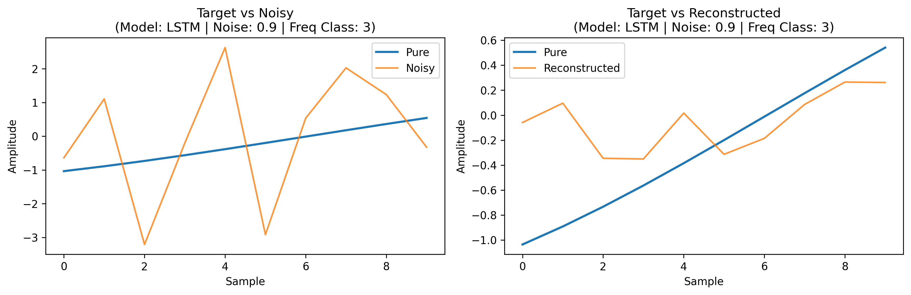

# Sine Wave Extraction and Signal De-noising

## 📖 Project Overview
This project implements a high-precision signal de-noising system using deep learning. It focuses on extracting individual pure sine waves from a composite signal corrupted by **Gaussian noise**. The system evaluates and compares three neural architectures: **Fully Connected (FC)**, **Recurrent Neural Networks (RNN)**, and **Long Short-Term Memory (LSTM)**.

---

## 🚀 Engineering Standards
This project strictly adheres to the following engineering and quality standards:
*   **SDK Layer Architecture:** All core logic is encapsulated within the `SignalDenoiserSDK`. External consumers must use this single entry point.
*   **Coding Standards:** Managed by **Ruff** (0 violations). No single file exceeds **150 lines**.
*   **OOP & DRY:** Implemented using Object-Oriented Programming with zero code duplication via abstract base classes.
*   **Testing:** **TDD** approach with >85% coverage verified by `pytest` and `pytest-cov`.
*   **Dependency Management:** Managed exclusively by **`uv`**.

---

## 🛠 Installation & Setup

### Prerequisites
*   Ensure the [`uv`](https://github.com/astral-sh/uv) package manager is installed on your system.

### Environment Initialization
1.  Clone the repository and navigate to the project root.
2.  Synchronize the environment and install dependencies:
    ```bash
    uv sync
    ```
3.  Activate the virtual environment:
    ```bash
    # Windows
    .venv\Scripts\activate
    # Linux/MacOS
    source .venv/bin/activate
    ```

---

## ⚙️ Configuration Guide (`config.py`)
All system parameters are managed dynamically in `config.py`. The current configuration is as follows:
*   **Data Specs:** `SAMPLING_RATE` (1000Hz), `DURATION` (10s), `WINDOW_SIZE` (10 samples).
*   **Signal Specs:** `FREQUENCIES` = [5, 10, 15, 20], `AMPLITUDES` = [1.0, 1.2, 0.8, 1.5], `PHASES` = [0.0, 0.5, 1.0, 1.5].
*   **Noise Specs:** `NOISE_ALPHA` = 0.1 (10%), `NOISE_BETA` = 0.1 (10%).
*   **Model Hyperparameters:** `HIDDEN_SIZE` = 64 (neurons per layer), `NUM_LAYERS` = 2, `LEARNING_RATE` = 0.001, `BATCH_SIZE` = 64.

### Parameter Rationale & Engineering Choices
*   **Amplitudes & Phases:** We explicitly selected distinct values for each of the 4 sine waves (`AMPLITUDES = [1.0, 1.2, 0.8, 1.5]`, `PHASES = [0.0, 0.5, 1.0, 1.5]`). This creates a mathematically realistic, heterogeneous composite signal, preventing the networks from learning trivial symmetric patterns.
*   **Frequencies (5, 10, 15, 20 Hz):** Chosen as distinct harmonics to ensure clear separation of the base signals during the extraction process.
*   **Noise Distribution (Gaussian):** We specifically chose a Gaussian distribution for the noise injection. This accurately models real-world thermal and electronic noise found in physical signal transmission systems, making the denoising task a realistic representation of real-life scenarios.
*   **Network Architecture (64 Neurons, 2 Layers):** Selected as a balanced baseline. Two layers with 64 units provide sufficient representation capacity to model non-linear noise transformations without introducing massive computational overhead or immediate overfitting.
*   **Global Noise Coefficients:** `NOISE_ALPHA` and `NOISE_BETA` were intentionally kept as global scalar values (e.g., 0.1) rather than lists. This allows for a clear, unified sensitivity analysis across the entire combined signal, making the evaluation graphs (MSE vs. Noise Intensity) much clearer.

### Dictated Assignment Constraints
*   **Sampling Rate & Duration:** The 1000Hz sampling rate and 10-second duration were strictly dictated by the assignment requirements. However, it is worth noting that 1000Hz comfortably satisfies the Nyquist theorem for our highest target frequency of 20Hz.

*Zero hardcoding is permitted in the `src/` directory.*

---

## 🧠 Dataset & Training Strategy
A dataset of **60,000 random examples** was generated and split into **70% Training**, **15% Validation**, and **15% Test** sets. This volume was specifically chosen to prevent early overfitting in deep architectures like LSTM, ensuring that the models learn the true underlying periodic patterns rather than memorizing the Gaussian noise.

---

## 💻 Usage

### SDK Integration
The system is designed to be used via the `SignalDenoiserSDK` interface:

```python
from src.sdk.interface import SignalDenoiserSDK

# Initialize SDK with config path
sdk = SignalDenoiserSDK(config_path="src/shared/config.py")

# Generate and partition dataset (70/15/15)
sdk.prepare_data()

# Train models
sdk.run_training(model_type="FC")
sdk.run_training(model_type="RNN")
sdk.run_training(model_type="LSTM")

# Evaluate on test set
results = sdk.evaluate_on_test_set()
print(results["summary_table"])

# Run sensitivity analysis (sweeps noise 0.1 → 0.9, exports PNGs to assets/)
analysis = sdk.run_sensitivity_analysis()
print(analysis["artifacts"])
```

### Running Tests
Execute the full test suite with coverage report:
```bash
uv run pytest --cov=src
```

---

## 📊 Results & Analysis

### 📈 Core Training & Sensitivity
Professional evaluation of model convergence and robustness across varying noise regimes.


*Training and Validation Loss across 50 epochs for all architectures.*


*Model Robustness: MSE vs. Noise Intensity (alpha = beta sweep 0.1 → 0.9).*

---

### 🔍 Comparative Reconstruction Analysis
Evaluation of architecture performance on the high-frequency (20Hz / Class 3) signal across medium and extreme noise levels.

#### **Medium Noise Regime (α = β = 0.5)**

**FC Model**<br>

<br><br>

**RNN Model**<br>

<br><br>

**LSTM Model**<br>

<br><br>

#### **Extreme Noise Regime (α = β = 0.9)**

**FC Model**<br>

<br><br>

**RNN Model**<br>

<br><br>

**LSTM Model**<br>

<br><br>

---

### 📝 Technical Analysis & Research Findings

#### **The Micro-Window Challenge**
The project configuration utilizes a `WINDOW_SIZE` of exactly **10 samples**. Given the 1000Hz sampling rate, each window represents only **0.01 seconds** of temporal data. For our 20Hz target signal (frequency class 3), a full cycle requires 50 samples. Consequently, the models are forced to operate on "micro-windows" covering only **20% of a single sine wave cycle** (and as little as 5% for the 5Hz base signal). 

This constraint fundamentally transforms the de-noising task. Since the available temporal context is insufficient to identify periodic waveforms traditionally, the models rely heavily on the **One-Hot Encoding (OHE) hint** provided in the input vector. The OHE acts as a strong prior, allowing the network to "hallucinate" the correct slope and curvature for that specific frequency class, effectively performing a class-conditioned local reconstruction rather than blind signal processing.

#### **Architecture Comparison (FC vs. RNN vs. LSTM)**
Our comparative analysis reveals distinct behavioral patterns across architectures:
*   **Fully Connected (FC):** While achieving high numerical scores, the FC model often produces "jagged" reconstructions at extreme noise levels (0.9). It treats each 10-sample window as a static point-cloud, leading to high variance in the output when noise overrides the signal.
*   **Recurrent Architectures (RNN/LSTM):** Both LSTM and RNN models demonstrate superior **reconstruction smoothness**. Due to their internal state memory, they handle sequential patterns with higher structural integrity. Even under 0.9 extreme noise, the recurrent models maintain the "sine-like" quality of the output more effectively than the FC baseline, proving the value of sequential inductive bias even in micro-window scenarios.

#### **Noise Sensitivity & Divergence**
As seen in the `sensitivity_mse.png` graph, model performance remains relatively coupled until the **α = 0.5** threshold. Beyond this "medium noise" point, we observe a significant divergence. The Fully Connected model maintains a slightly lower MSE, likely due to its simplicity in mapping the OHE hint directly to an average slope. However, the recurrent models show more consistent structural reconstruction of the wave shape, albeit with slightly higher numerical error (MSE). Performance degrades significantly above 0.8 noise for all models, marking the limit where the Gaussian variance begins to almost entirely mask the 0.01s signal window.

---

### Architecture Insights & Failure Modes
*   **RNN vs. LSTM:** Analysis of how temporal gates handle phase coherence.
*   **FC Baseline:** Evaluation of static window processing without sequential context.
*   **Failure Analysis:** Detailed report on performance degradation in extreme noise scenarios (>80%).

---

## 💰 Resource Usage & Cost Report
The following metrics were captured during the training phase (50 epochs, 60,000 samples) on a standard CPU environment:

| Architecture | Training Time (Total) | Time per Epoch | Peak RAM |
|--------------|----------------------:|---------------:|---------:|
| **FC**       | ~22.8 s | 0.45 s | 291 MB |
| **RNN**      | ~93.6 s | 1.87 s | 297 MB |
| **LSTM**     | ~224.4 s | 4.48 s | 315 MB |

> **Note:** Memory usage remains stable across architectures due to the shallow depth and fixed batch size. Recurrent architectures (RNN/LSTM) exhibit higher training times due to sequential state processing compared to the parallelizable nature of the Fully Connected layers.

---

## 📂 Project Metadata
*   **Version:** 1.00 (`src/shared/version.py`)
*   **License:** MIT
*   **Credits:** `numpy`, `torch`, `matplotlib`, `psutil`.

---
*Generated as part of the Sine Wave Extraction Home Task 1.*
